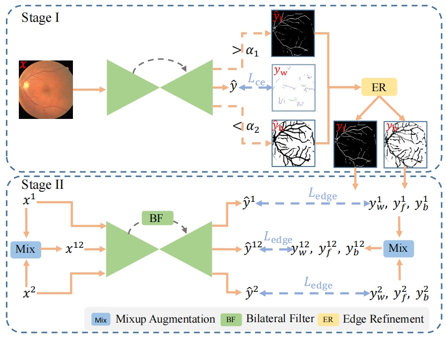

# Edge-Aware Vessel Segmentation using Scribble Supervision<!--参考https://github.com/HeliosZhao/NCDSS/blob/master/README.md-->


This repository contains the official implementation of our paper:

> **Edge-Aware Vessel Segmentation using Scribble Supervision, IEEE International Symposium on Biomedical Imaging 2024**
> 
> Zhanqiang Guo, [Jianjiang Feng](http://ivg.au.tsinghua.edu.cn/~jfeng/), Jie Zhou

> Paper: <!--[TMI2024](https://ieeexplore.ieee.org/abstract/document/10423041)  [ArXiv](https://arxiv.org/abs/2402.12128)-->
  <!--Project Page: [Website](https://ncdss.github.io)-->

> **Abstract:** Accurate segmentation of blood vessels is critical for diagnosing various diseases. However, the complexity of manually labeling vessels impedes the practical adoption of fully supervised methods. To alleviate this challenge, we propose a weakly supervised vessel segmentation framework. Our approach leverages scribble annotation to train the Unet and identifies reliable foreground and background regions. Addressing the issue of insufficient boundary information inherent in scribble annotation, we incorporate a conventional approach specifically designed to leverage the innate structural attributes of vessels for edge detection, subsequently ensuring effective edge supervision. In addition, a bilateral filtering module is introduced to improve edge awareness of network. Furthermore, to augment the quantity of annotated pixels, we employ an image mixing strategy for data augmentation, thereby enhancing the network's segmentation capability. The experimental results on three datasets show that our framework outperforms the existing scribble-based methods.
<br>
<p align="center">
     <br />
    <em>
    Illustration of The Proposed Framework.
    </em>
</p>
<br>

## News
- **[Feb 22 2024]** :bell: Code is coming soon. 
  

## Requirements

* Python = 3.8
* Pytorch = 1.10.0
* CUDA = 11.1
* Install other packages in `requirements.txt`

## Citation
We hope you find our work useful. If you would like to acknowledge it in your project, please use the following citation:
```
@inproceedings{guo2024edge,
  title={Edge-Aware Vessel Segmentation using Scribble Supervision},
  author={Guo, Zhanqiang and Feng, Jianjiang and Zhou, Jie},
  booktitle={2024 IEEE 21th International Symposium on Biomedical Imaging (ISBI)},
  pages={1--5},
  year={2024},
  organization={IEEE}
}
```

## Contact me

If you have any questions about this code, please do not hesitate to contact me.

Zhanqiang Guo: guozq21@mails.tsinghua.edu.cn